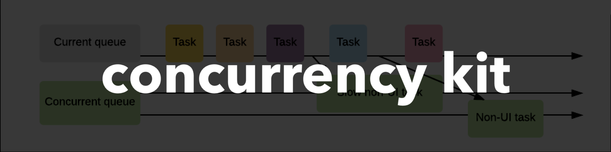

# concurrency-kit [](https://github.com/sindresorhus/awesome)

[]()
[](https://codecov.io/gh/jVirus/concurrency-kit)
[]()
[]()
[]()
[]()
[]()

**Last Update: 05/January/2020.**



### If you like the project, please give it a star ⭐ It will show the creator your appreciation and help others to discover the repo.

# ✍️ About
🚄 Concurrency abstractions framework for `iOS` development [`Task`, `Atomic`, `Lock`, etc.].

# 🔥 Features
- **Atomics** - synchronization primitive that is implemented in several forms: `Generic`, `Int` and `Bool`.
  - `Fast`. Under the hood a mutex (`pthread_mutex_lock`) that is more efficient than `OSSpinLock` and faster than `NSLock`.
  - `Throwable`. You can safely throw `Errors` and be able to delegate the handling.
- **Locks** - contains a number of locks, such as:
  - `UnfairLock` - A lock which causes a thread trying to acquire it to simply wait in a loop ("spin") while repeatedly checking if the lock is available.
  - `ReadWriteLock` - An `RW` lock allows concurrent access for read-only operations, while write operations require exclusive access.
  - `Mutex` - Allows only one thread to be active in a given region of code.
- **DispatchQueue+Extensions** - extended `DispatchQueue`, where `asyncAfter` and `once` methods add convenience.
- **Task** - A unit of work that performs a specific job and usually runs concurrently with other tasks.
  - Tasks can be `grouped` - meaning that you are able to compose the tasks, similar to `Futures & Promises` and execute them serially.
  - Tasks can be `sequenced` - meaning that you are able to compose different `groups` and execute them concurrently. No need to repeatedly use `DispatchGroup` (`enter`/`leave`). 
- **Stateful Operation** - is a custom `Operation` class that supports modern, `Swifty` state management through the usage of `Atomics` and `Enum` types.
- **Thoroughly** tested.

# 📚 Examples

## Task
In order to create a `Task`, you need to simply use the `Task` struct and the `trailing closure` syntax:

```swift
let uploadingTask = Task { controller in
  uploader(photos) { result in 
    switch result {
      case .success:
        controller.finish()
      case .failure(let error):          
        controller.fail(with error)
    }
  }
}
        
uploadingTask.perform { outcome in
  handle(outcome)
}
```

You can group the tasks, so the concurrent operations will be performed sequentially, one after another. Then, you can chain a completion closure to handle the outcome:

```swift
let filesToUpload = [file, photo, video, xml]

let group = Task.group(fileToUpload)
group.perform { outcome in 
  handle(outcome)
}
```

Or you can concurrently perform a collection of tasks. They will be executed asynchronously, in parallel (if possible) or concurrently, that is up to the `GCD`:

```swift
let filesToUpload = [file, photo, video, xml]

let group = Task.sequence(filesToUpload)
group.perform { outcome in 
  handle(outcome)
}
```

## Stateful Operation
Operation that has more 'Swifty' state management system, where state is an enum type with a number of possible cases. In order to demostrate the typical usage, let's define a new custom operation for network request:

```swift
class NetworkStatefulOperation: StatefullOperation {

  // MARK: - Properties
  
  private let callback: (StatefullOperation?) -> Void
  private let service: NetworkService             
  private let dataHandler: Parsable            
            
  // MARK: - Initializers
  
  init(_ service: NetworkService, _ dataHandler: Parser, callback: @escaping (StatefullOperation?) -> Void) {
    self.service = service
    self.dataHandler = dataHandler
    self.callback = callback
  }
  
  // MARK: - Overrides
  
  override func executableSection() {
    service.dataTask { [weak self] result in 
      self?.dataHandler.parse(result)
      self?.finishIfNotCancelled()
      self?.callback(self)
    }
  }
}
```

Then, the usage of the `NetworkStatefulOperation` class is quite straightforward:

```swift
// 1. Create an instance of `NetworkStatefulOperation` class:
let networkiOperation = NetworkStatefulOperation(service, parser) {
  // 3. As soon as the operation is finished, this closure will be executed with the operation state that can futher be handled to properly update the UI:
  updateUI(with: $0.state)
}
// 2. Then call the `start` method:
networkOperation.start()
```

## Atomics
Guarantees safe mutation of a property in multiple async dispatch queues. Simply wrap a property in `Atomic` type:

```swift
let atomic = Atomic(0)

DispatchQueue.global().async {
  atomic.modify { $0 + 1 }
}

DispatchQueue.global().async {
  atomic.modify { $0 + 1 }
}
```

You can also use slightly more performance-friendly `AtomicInt` and `AtomicBool` classes, hence there is no dynamic dispatch involved (though `Swift` compiler is smart enough to apply complier optimization called [`compile-time generic specialization`](https://forums.swift.org/t/compile-time-generic-specialization/5082))

## Locks

### Read Write Lock
A syncronozation primitive that solves one of the readers–writers problems:

```swift
let rwLock = ReadWriteLock()

rwLock.writeLock()
sharedValue += 1
rwLock.unlock()
```

Or you can restrict the reading access, so other threads will not be able to read the mutated value of a property until the lock will be released:

```swift
let rwLock = ReadWriteLock()

rwLock.readLock()
sharedValue += 1
rwLock.unlock()
```

### Unfair Lock
A lock which causes a thread trying to acquire it to simply wait in a loop ("spin"), while repeatedly checking if the lock is available:

```swift
let unfairLock = UnfairLock()

unfairLock.lock()
sharedValue += 1
unfairLock.unlock()
```

### Mutex
Used to protect shared resources. A mutex is owned by the task that takes it. In a given region of code only one thread is active:

```swift
let mutex = Mutex()

mutex.withCriticalScope {
  return sharedValue += 1
}
```

## Dispatch Queue
There is a convenience method that removes the need to pass `.now() + time` in order to make an async call:

```swift
DispatchQueue.main.asyncAfter(seconds: 2.5) {
  expectation.fulfill()
}
```

Also, `DispatchQueue.once` was returned back::

```swift
// The following concurrentQueue is called multiple times, though the caughtValue will be set to value only once.
concurrentQueue.async {
  DispatchQueue.once(token: "caught") {
    caughtValue = value
  }
}
```

# 🏗 Installation

## Swift Package Manager

### Xcode 11+

1. Open `MenuBar` → `File` → `Swift Packages` → `Add Package Dependency...`
2. Paste the package repository url `https://github.com/jVirus/concurrency-kit` and hit `Next`.
3. Select the installment rules.

After specifying which version do you want to install, the package will be downloaded and attached to your project. 

### Package.swift
If you already have a `Package.swift` or you are building your own package simply add a new dependency:

```swift
dependencies: [
    .package(url: "https://github.com/jVirus/concurrency-kit", from: "1.0.0")
]
```

## Manual 
You can always use copy-paste the sources method 😄. Or you can compile the framework and include it with your project.


# 👨‍💻 Author 
[Astemir Eleev](https://github.com/jVirus)

# 🔖 Licence
The project is available under [MIT licence](https://github.com/jVirus/concurrency-kit/blob/master/LICENSE)
